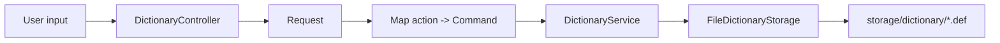

# EV Dictionary Pro - Developer Guide

## 1. Tổng Quan Kiến Trúc
Ứng dụng được tổ chức theo các lớp rõ ràng:

- `controller/DictionaryController`: nhận dòng lệnh, chuẩn hóa thành `Request`, sau đó định tuyến bằng `Map`
- `command/*`: thực thi từng hành động cụ thể như `lookup`, `define`, `drop`, `export`, `import`
- `service/DictionaryService`: chứa toàn bộ logic nghiệp vụ và là `Singleton`
- `storage/FileDictionaryStorage`: đọc và ghi dữ liệu trực tiếp từ thư mục `storage/dictionary`
- `entity/*`: đóng gói dữ liệu từ điển thành object
- `factory/EntityFactory`: tạo entity thống nhất



## 2. Luồng Xử Lý Lệnh
### Lookup
1. Controller nhận `lookup positive`
2. Controller tạo `Request(action=lookup, keyword=positive)`
3. `LookupCommand` gọi `DictionaryService.lookup`
4. `DictionaryDisplayFormatter` dựng lại phần hiển thị gồm phát âm, nghĩa, ví dụ, đồng nghĩa

### Define
1. Controller nhận `define --adjective positive`
2. Controller chuẩn hóa flag thành một `DefineMode`
3. Controller hỏi thêm dữ liệu cần thiết qua console
4. `DefineCommand` tạo hoặc cập nhật `DictionaryEntry`
5. `DictionaryService.define` lưu toàn bộ entry xuống file

### Drop
1. Controller nhận `drop positive`
2. `DropCommand` gọi `DictionaryService.drop`
3. File `.def` tương ứng bị xóa khỏi `storage/dictionary`

### Export
1. Controller nhận `export eng-vie.txt`
2. `ExportCommand` gọi `DictionaryService.export`
3. Consumer tiến trình in `10%..20%..` cho tới khi hoàn tất

## 3. Request Contract
Request được chuẩn hóa trước khi xử lý:

```text
{
  action: 'define',
  keyword: 'positive',
  pronunciation: '/ˈpɒzətɪv/',
  meaning: 'tich cuc',
  params: ['-a', 'a positive factor', 'một nhân tố tích cực']
}
```

Quy ước hiện tại:
- `action`: tên lệnh
- `keyword`: từ cần tra, thêm, xóa, hoặc đường dẫn xuất dữ liệu
- `pronunciation`: phát âm khi define kiểu pronunciation
- `meaning`: nghĩa chính khi define kiểu danh từ/tính từ/động từ
- `params`: danh sách tham số phụ, bao gồm flag và câu mẫu

## 4. Entity Model
- `Word`: từ khóa
- `Pronunciation`: phiên âm
- `Definition`: nghĩa theo từ loại
- `ExampleSentence`: câu ví dụ và nghĩa câu
- `Synonym`: từ đồng nghĩa
- `DictionaryEntry`: tập hợp đầy đủ dữ liệu của một mục từ

`Definition` hiện có thêm danh sách câu ví dụ riêng để lookup hiển thị đúng theo từng nghĩa.

## 5. Storage Format
Mỗi mục từ được lưu trong một file `.def` riêng.

Ví dụ:

```text
keyword=positive
pronunciation=/ˈpɒzətɪv/
definition=ADJECTIVE|tich cuc, xac thuc va ro rang
definition-example=A positive attitude helps people solve problems.|Thai do tich cuc giup moi nguoi giai quyet van de.
synonym=beneficial
```

Quy tắc xử lý:
- `keyword=` khởi tạo entry mới
- `definition=` tạo một nghĩa mới
- `definition-example=` gắn ví dụ vào đúng definition gần nhất
- `sentence=` là dữ liệu ví dụ cấp mục từ cũ, vẫn được hỗ trợ để tương thích ngược
- `synonym=` ghi từ đồng nghĩa

## 6. Cấu Trúc Dữ Liệu
- `Map<String, DictionaryEntry>` dùng cho lookup nhanh
- `LinkedList` dùng trong entity để chèn/xóa ổn định và giữ thứ tự dữ liệu
- `Map<String, Command>` dùng trong controller để định tuyến theo action

## 7. Mẫu Thiết Kế
- `Singleton`: `DictionaryService`
- `Factory`: `EntityFactory`
- `Command/Strategy`: lớp command và map định tuyến
- `MVC-ish` cho CLI: controller nhận input, service xử lý nghiệp vụ, entity/storage tách riêng

## 8. Kiểm Thử
Kiểm thử hiện có nằm ở `src/test/java/com/dict/service/DictionaryServiceTest.java`.

Chạy kiểm thử:

```bash
mvn test
```

## 9. Mở Rộng Hệ Thống
Khi thêm lệnh mới:
1. Tạo command mới trong `src/main/java/com/dict/command/`
2. Đăng ký command trong `DictionaryController`
3. Nếu cần input mới, chuẩn hóa thêm vào `Request`
4. Thêm test cho service hoặc command tương ứng

Khi thêm field mới vào entity:
1. Cập nhật entity
2. Cập nhật `EntityFactory`
3. Cập nhật `FileDictionaryStorage`
4. Bổ sung test lưu/đọc tương ứng